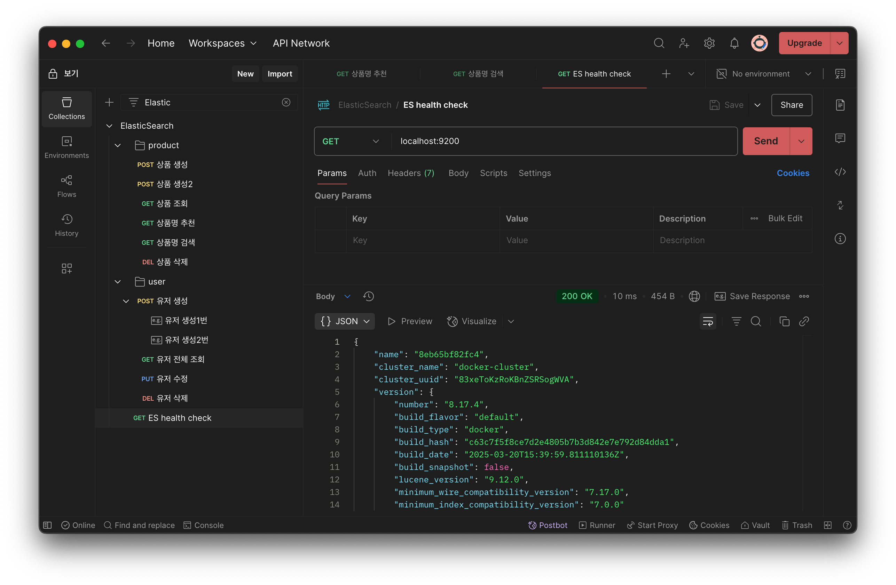
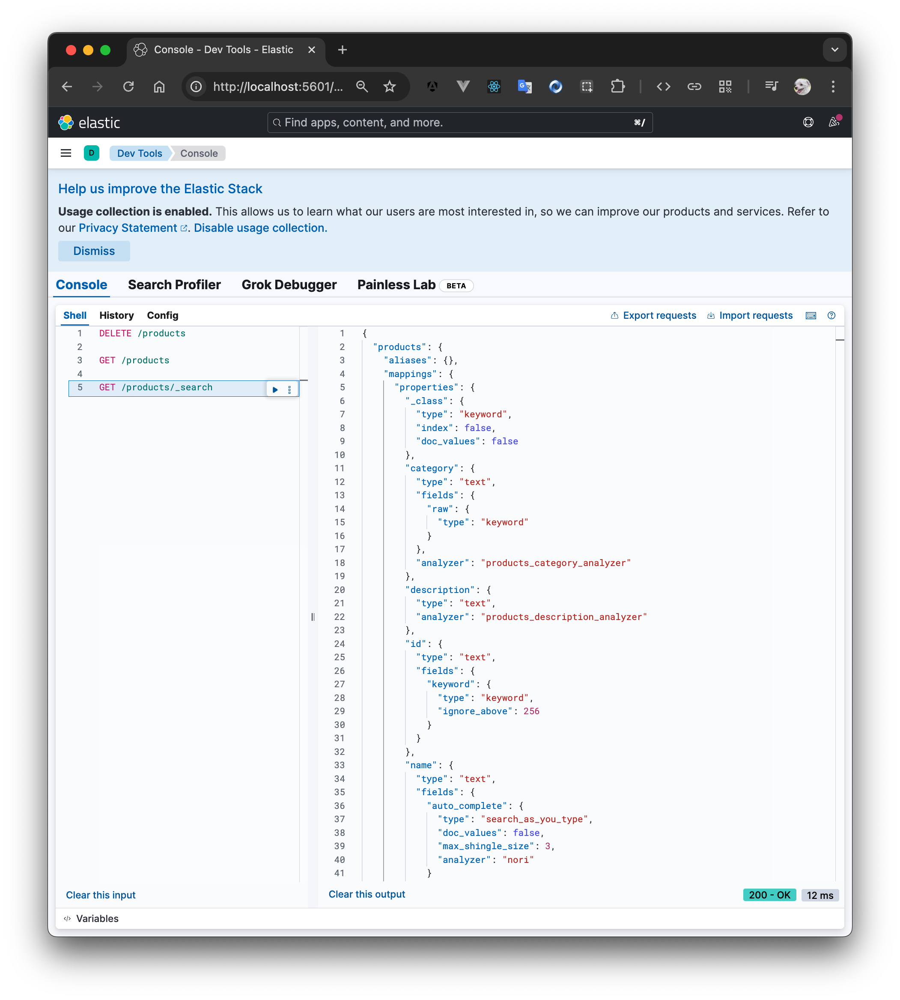
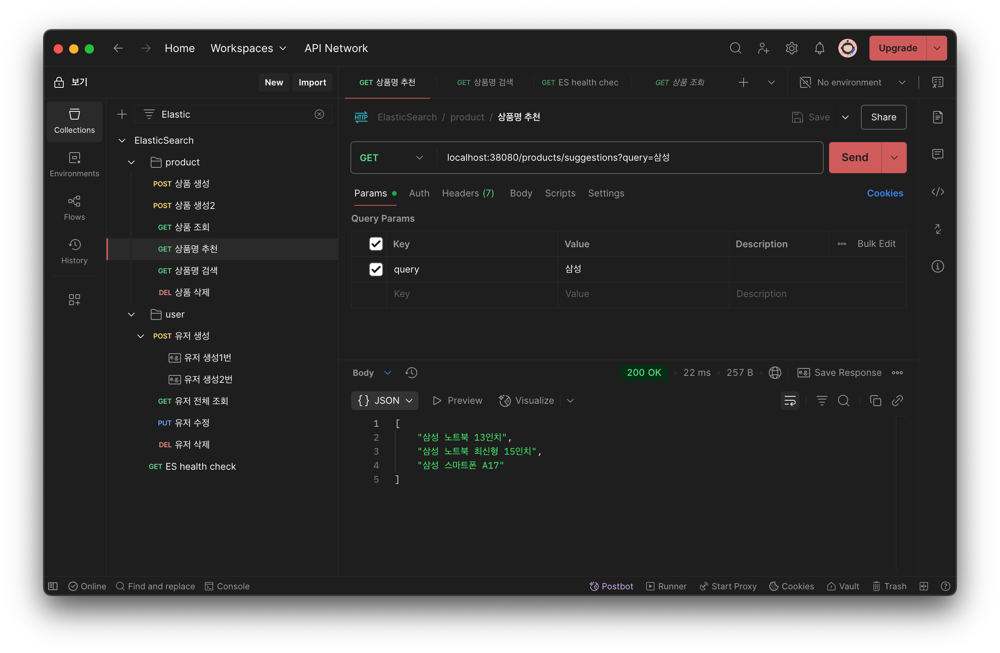
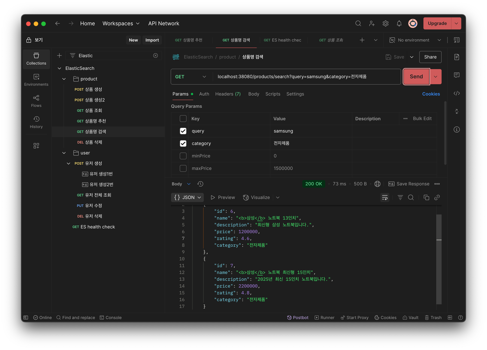

## ElasticSearch Study Repository

### 사용 기술
* Kotlin 1.9
* Springboot 3.5
* MySQL
* Elasticsearch / data-elasticsearch
  * Nori Analyzer(한글 분석)
* JPA / data-jpa
* Kibana
* Docker(compose)

---

### 기능
* 상품 CRUD(Mysql, ElasticSearch)
* 단어 추천(자동완성) - ngram 
* Synonym 동의어 검색
* Multimatch with score: 여러 조건 검색(가중치)
* Range Filter: 가격범위 검색
* Rating Should: 특정조건 만족 상위노출
* Highlight: 검색어 강조태그

---

입력 데이터
```
{
  "name": "삼성 노트북 13인치",
  "description": "최신형 삼성 노트북입니다.",
  "price": 1200000,
  "rating": 4.6,
  "category": "전자제품"
}

{
  "name": "삼성 노트북 최신형 15인치",
  "description": "2025년 최신 15인치 노트북입니다.",
  "price": 2200000,
  "rating": 4.8,
  "category": "전자제품"
}

{
  "name": "삼성 스마트폰 A17",
  "description": "최신형 스마트폰, 휴대전화",
  "price": 1500000,
  "rating": 4.5,
  "category": "휴대폰"
}
```

---

### 응답 화면
es-health-check


kibana


suggestions


search
